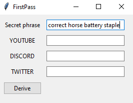
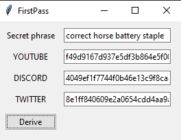

# FirstPass

Demonstration of a way to generate passwords using a 'correct horse battery staple like phrase' that you've memorised.


It takes a phrase you've memorised, appends some words corresponding to domains to it, then applies:

```
sha3_512({your_phrase} + " {DOMAIN}")
```

This is incredibly dumb please don't look too much into it. The underlying code is trash too, I'm doing this at 2am on Christmas Eve with my cat sat on me.

The point here is that it isn't hard to come up with a way to generate secure passwords and you don't need to rely on tools such as LastPass to do so provided you understand a bit of basic cryptography.


# How To

I guess I'll put this here in case I decide to abstract this further to arbitrary domains that you can keep in a file to load up.

Step 1: Enter secret phrase



Step 2: Hit Derive



Step 3: Use passwords.

If your password gets burned in a leak, just change what you append to the secret phrase from, e.g. YOUTUBE to YOUTUBE2. Fresh password, you give nothing away about the phrase itself.
